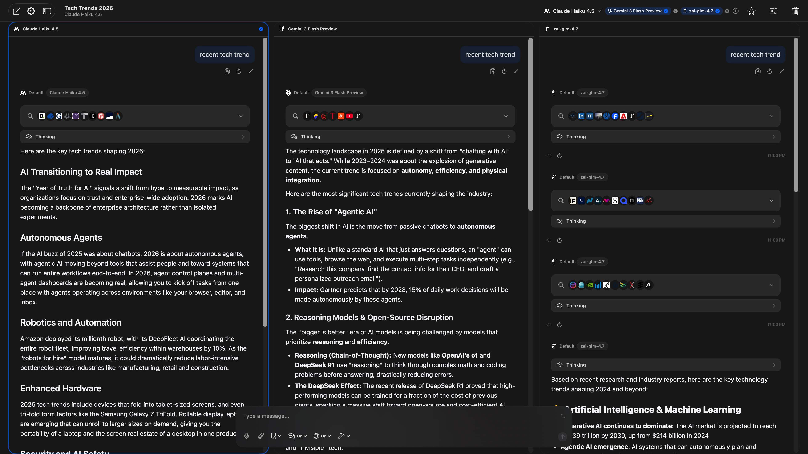

<p align="center">
  
</p>

# Jin

A native macOS app for chatting with multiple LLM providers from one workspace.
Conversation-first: fast, focused, and minimal.


## Why Jin

- **Conversation-first** — Built around high-quality chat flow, not workspace clutter
- **Focused controls** — Model, reasoning, tool, and media controls stay close to the conversation
- **Full API access** — Expose provider parameters as completely as practical instead of hiding them behind generic presets
- **Native macOS** — SwiftUI app with keyboard shortcuts, drag-and-drop, and proper windowing — no Electron

## Supported Providers

Jin supports 18 provider types:

OpenAI · OpenAI (WebSocket) · Anthropic · Gemini (AI Studio) · Vertex AI · xAI · DeepSeek · Mistral · Cohere · Groq · Perplexity · Fireworks · Cerebras · DeepInfra · OpenRouter · OpenAI Compatible · Cloudflare AI Gateway · Codex App Server (Beta)

Most providers are pre-configured on first launch; you can add the remaining types via **Settings > Providers > Add Provider**. Use **Fetch Models** in provider settings to pull the latest available models, or add models manually.

For **Codex App Server (Beta)**, models run on the server side, so Jin does not need per-model client adaptation.

### Provider setup notes

- **Vertex AI** uses a Google Cloud service account JSON (not an API key). Optional `location` in the JSON defaults to `global`.
- **Cloudflare AI Gateway** expects the `/compat` endpoint. Replace `{account_id}` and `{gateway_slug}` in the Base URL, then use compound model IDs like `openai/gpt-5` or `anthropic/claude-sonnet-4-6`.
- **Codex App Server (Beta)** expects a running `codex app-server --listen ws://127.0.0.1:4500` process (or launch from provider settings). Auth can be an API key, a ChatGPT account, or Local Codex (reads `auth.json` from `$CODEX_HOME` or `~/.codex`).
- **OpenAI Compatible** expects OpenAI-style endpoints: `GET /v1/models` and `POST /v1/chat/completions`.
- **OpenAI (WebSocket)** keeps a persistent connection to `/v1/responses`; only one response can be in flight per connection.

### Included Models

These models are ready to use out of the box once you've configured provider credentials. You can also add any other model manually or via **Fetch Models**.

| Provider | Models |
|----------|--------|
| OpenAI | `gpt-5.2`, `gpt-5.2-2025-12-11`, `gpt-5.3-codex`, `gpt-4o` |
| OpenAI (WebSocket) | `gpt-5.2`, `gpt-5.2-2025-12-11`, `gpt-5.3-codex`, `gpt-4o` |
| Anthropic | `claude-opus-4-6`, `claude-sonnet-4-6`, `claude-opus-4-5-20251101`, `claude-sonnet-4-5-20250929`, `claude-haiku-4-5-20251001` |
| Gemini (AI Studio) | `gemini-3-pro-preview`, `gemini-3.1-pro-preview`, `gemini-3-pro-image-preview`, `gemini-3-flash-preview`, `gemini-2.5-flash-image` |
| Vertex AI | `gemini-3-pro-preview`, `gemini-3.1-pro-preview`, `gemini-3-pro-image-preview`, `gemini-3-flash-preview`, `gemini-2.5-pro`, `gemini-2.5-flash-image` |
| xAI | `grok-4-1-fast`, `grok-4-1`, `grok-imagine-image`, `grok-imagine-image-pro`, `grok-2-image-1212`, `grok-imagine-video` |
| DeepSeek | `deepseek-chat`, `deepseek-reasoner`, `deepseek-v3.2-exp` |
| Perplexity | `sonar`, `sonar-pro`, `sonar-reasoning-pro`, `sonar-deep-research` |
| Fireworks | `fireworks/glm-5`, `fireworks/minimax-m2p5`, `fireworks/kimi-k2p5`, `fireworks/glm-4p7` |
| Codex App Server (Beta) | `gpt-5.1-codex` (default seed), plus models exposed by your server (server-side execution; no per-model client adaptation required) |
| Groq, Cohere, Mistral, DeepInfra, OpenRouter, OpenAI Compatible, Cloudflare AI Gateway, Cerebras | Use **Fetch Models** or add manually |

Note: this list reflects seeded models that are preloaded for quick start. Additional catalog-known models can be accepted when added manually (for example unseeded OpenAI variants), and manually entered models fall back to conservative defaults when capabilities are unknown.

## Features

- **Multi-provider chat** — Switch between providers and models within the same workspace
- **Parallel multi-model chat** — Ask up to 3 models in one chat, with side-by-side responses and independent per-model context
- **Multimodal conversations** — Text, images, files, audio, and generated media in one thread
- **Reasoning models** — Collapsible thinking blocks for models that support extended reasoning, with per-model budget controls
- **Web search** — Provider-native search plus fallback through built-in search plugins (Exa, Brave, Jina, Firecrawl, Tavily), with in-chat search activity, citations, and source timeline
- **Context caching** — Model-aware caching controls (mode, TTL, strategy) across supported providers
- **Tool calling (MCP)** — Connect external tools and data via the Model Context Protocol using persistent or ephemeral servers
- **Image generation + edits** — Gemini, Vertex AI, and xAI image generation; xAI supports image edit flows by attaching a source image
- **Video generation + edits** — Gemini/Vertex Veo and xAI video flows, with optional public URL input for editable workflows
- **PDF processing** — Native PDF for supported models, or explicit Mistral/DeepSeek OCR modes and local macOS extraction fallback
- **Voice** — Speech-to-text (dictation or audio attachment when supported) and text-to-speech from assistant messages
- **Assistants** — Named assistants with custom prompts, model defaults, language preference, temperature/output limits, and optional history truncation

## Screenshots

<p align="center">
  
</p>

<p align="center">
  
</p>

<p align="center">
  
</p>

<p align="center">
  
</p>

<p align="center">
  
</p>

<p align="center">
  
</p>

## Plugins

All plugins are optional and configured in **Settings > Plugins**.

| Plugin | Services |
|--------|----------|
| Web Search | Exa, Brave Search, Jina Search, Firecrawl, Tavily |
| Text-to-Speech | ElevenLabs, OpenAI, Groq |
| Speech-to-Text | OpenAI, Groq, Mistral |
| Mistral OCR | Mistral OCR for PDF extraction |
| DeepSeek OCR | DeepSeek OCR (via DeepInfra) for PDF extraction |
| Chat Naming | Automatic conversation naming with a selected model |
| Cloudflare R2 Upload | Upload local videos to R2 and send public URLs |

## MCP (Model Context Protocol)

Connect MCP servers for tool calling under **Settings > MCP Servers**. Jin supports long-running (persistent) and short-lived (ephemeral) MCP servers over stdio or HTTP/SSE transports. Server presets and `mcpServers` JSON import are supported; each server keeps separate tool enablement, and MCP calls can be used with per-chat controls.

## Installation

### Download

Download the latest release from the [Releases](../../releases) page. Assets are typically `Jin.zip` (containing `Jin.app`) or `Jin.dmg`.
If your release is zipped, unzip it first.

### If macOS blocks the app

If macOS shows a warning like "is damaged and can't be opened" or "Apple could not verify":

1. Move `Jin.app` to `/Applications`.
2. Right-click `Jin.app` and choose **Open** once.
3. If it is still blocked, open **System Settings > Privacy & Security**.
4. Click **Open Anyway** for Jin, then confirm **Open**.
5. If needed, clear quarantine and retry:

```bash
xattr -dr com.apple.quarantine /Applications/Jin.app
```

### Requirements

- macOS 14 (Sonoma) or later

## Getting Started

1. Launch Jin.
2. Open **Settings** and add a provider (API key for most providers; service account JSON for Vertex AI; optional for Codex App Server).
3. Start a new conversation and pick a model.
4. Optional: configure MCP servers under **Settings > MCP Servers** for tool calling.

## Build from Source

```bash
git clone https://github.com/hrayleung/Jin.git
cd Jin
swift build
swift test
swift run Jin            # Run from the command line (Debug)
open Package.swift          # Open in Xcode
bash Packaging/package.sh   # Build universal release .app bundle and create dist/Jin.zip
bash Packaging/package.sh dmg  # Optional: also create a DMG
```

Requires Swift 5.9+ / Xcode 15+.

## Updates & Release

Jin uses [Sparkle](https://github.com/sparkle-project/Sparkle) for in-app updates.

- Update feed and signing key are configured in `Packaging/Info.plist` (`SUFeedURL`, `SUPublicEDKey`).
- The appcast lives at `docs/appcast.xml` (published via GitHub Pages for the upstream repo).
- CI packaging/signing is in `.github/workflows/ci-cd.yml` (Build + notarized DMG on `v*` tags).

Maintainers: see `docs/sparkle-update.md` for the recommended `generate_appcast` signing workflow and release checklist.

## Contributing

Contributions are welcome. All contributions fall under the same [PolyForm Noncommercial License](LICENSE).

## License

[PolyForm Noncommercial License 1.0.0](LICENSE) — free to use, modify, and distribute for noncommercial purposes. See the [full license text](https://polyformproject.org/licenses/noncommercial/1.0.0/) for details.

## Acknowledgments

- [MCP Swift SDK](https://github.com/modelcontextprotocol/swift-sdk) — Model Context Protocol client library
- [Sparkle](https://github.com/sparkle-project/Sparkle) — In-app update framework for macOS
- [Lobe Icons](https://github.com/lobehub/lobe-icons) — Provider icon assets
