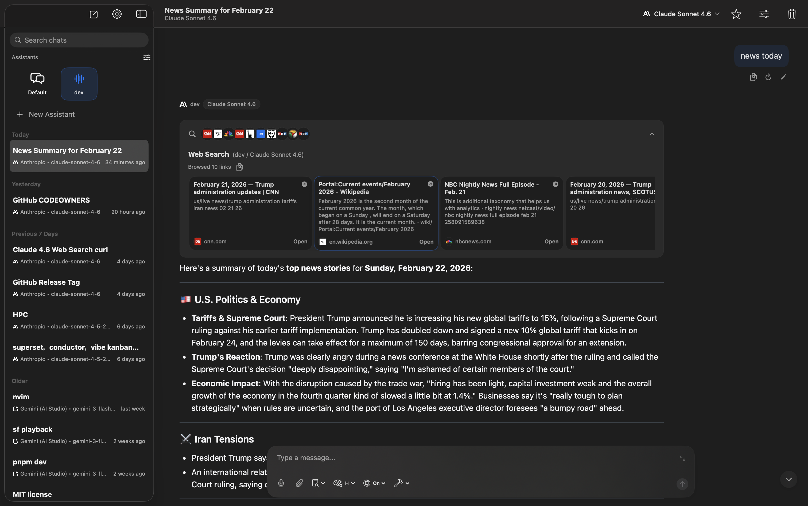
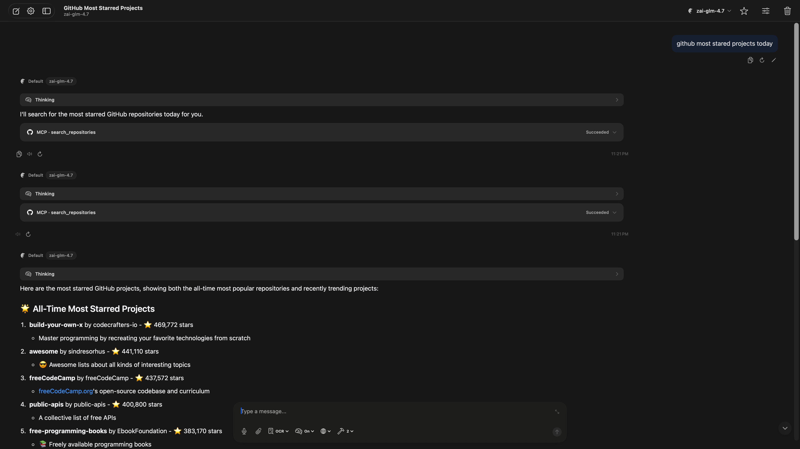
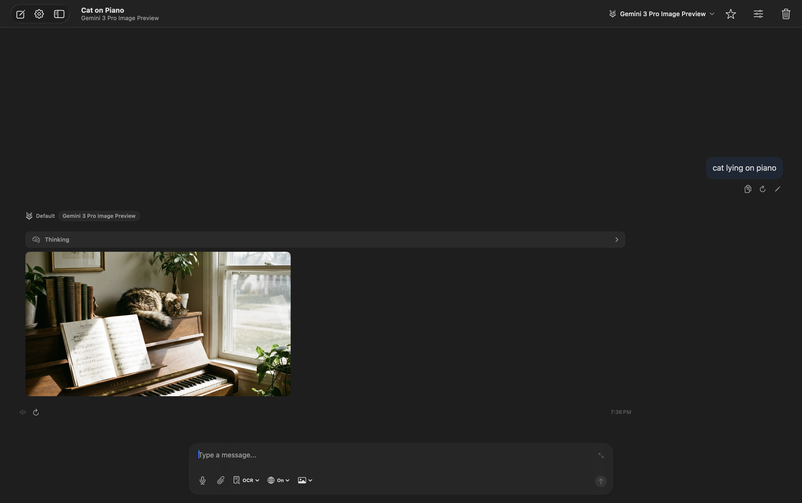
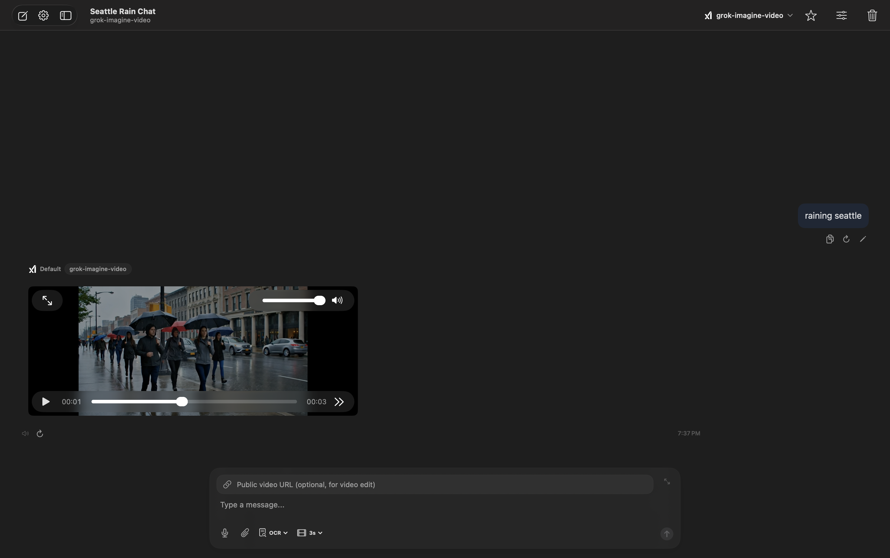
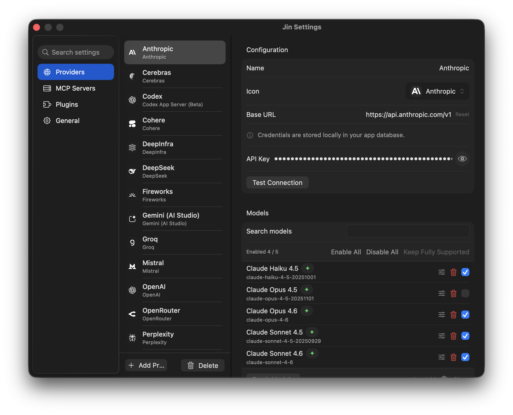

<p align="center">
  
</p>

# Jin

A native macOS app for chatting with multiple LLM providers from one workspace.
Conversation-first: fast, focused, and minimal.


## Why Jin

- **Conversation-first** — Built around high-quality chat flow, not workspace clutter
- **Focused controls** — Model, reasoning, tool, and media controls stay close to the conversation
- **Full API access** — Expose provider parameters as completely as practical instead of hiding them behind generic presets
- **Native macOS** — SwiftUI app with keyboard shortcuts, drag-and-drop, and proper windowing — no Electron

## Supported Providers

Jin supports 16 provider types:

OpenAI · Anthropic · Gemini (AI Studio) · Vertex AI · xAI · DeepSeek · Mistral · Cohere · Groq · Perplexity · Fireworks · Cerebras · DeepInfra · OpenRouter · OpenAI Compatible · Codex App Server (Beta)

Most providers are pre-configured on first launch. Use **Fetch Models** in provider settings to pull the latest available models, or add models manually.

For **Codex App Server (Beta)**, models run on the server side, so Jin does not need per-model client adaptation.

### Included Models

These models are ready to use out of the box (with your API key). You can also add any other model manually or via **Fetch Models**.

| Provider | Models |
|----------|--------|
| OpenAI | `gpt-5.2`, `gpt-5.2-2025-12-11`, `gpt-4o` |
| Anthropic | `claude-opus-4-6`, `claude-sonnet-4-6`, `claude-opus-4-5-20251101`, `claude-sonnet-4-5-20250929`, `claude-haiku-4-5-20251001` |
| Gemini (AI Studio) | `gemini-3-pro-preview`, `gemini-3.1-pro-preview`, `gemini-3-pro-image-preview`, `gemini-3-flash-preview`, `gemini-2.5-flash-image` |
| Vertex AI | `gemini-3-pro-preview`, `gemini-3.1-pro-preview`, `gemini-3-pro-image-preview`, `gemini-3-flash-preview`, `gemini-2.5-pro`, `gemini-2.5-flash-image` |
| xAI | `grok-4-1-fast`, `grok-4-1`, `grok-imagine-image`, `grok-2-image-1212`, `grok-imagine-video` |
| DeepSeek | `deepseek-chat`, `deepseek-reasoner` |
| Perplexity | `sonar`, `sonar-pro`, `sonar-reasoning-pro`, `sonar-deep-research` |
| Fireworks | `fireworks/glm-5`, `fireworks/minimax-m2p5`, `fireworks/kimi-k2p5`, `fireworks/glm-4p7` |
| Codex App Server (Beta) | Use models exposed by your server (server-side execution; no per-model client adaptation required) |
| Groq, Cohere, Mistral, DeepInfra, OpenRouter, OpenAI Compatible, Cerebras | Use **Fetch Models** or add manually |

## Features

- **Multi-provider chat** — Switch between providers and models within the same workspace
- **Multimodal conversations** — Text, images, files, audio, and generated media in one thread
- **Reasoning models** — Collapsible thinking blocks for models that support extended reasoning
- **Web search** — Provider-native search controls with in-chat search activity timeline
- **Context caching** — Unified prompt caching controls across supporting providers
- **Tool calling (MCP)** — Connect external tools and data via the Model Context Protocol
- **Image generation** — Gemini, Vertex AI, and xAI image models
- **Video generation** — Gemini/Vertex Veo and xAI video models
- **PDF processing** — Mistral OCR, DeepSeek OCR, or local PDFKit text extraction
- **Voice** — Speech-to-Text and Text-to-Speech via multiple providers
- **Assistants** — Named assistants with custom system instructions, model defaults, and reply language

## Screenshots

<table>
  <tr>
    <td>
      
    </td>
    <td>
      
    </td>
  </tr>
  <tr>
    <td>
      
    </td>
    <td>
      
    </td>
  </tr>
</table>

<p align="center">
  
</p>

## Plugins

All plugins are optional and configured in **Settings > Plugins**.

| Plugin | Services |
|--------|----------|
| PDF OCR | Mistral OCR, DeepSeek OCR (DeepInfra), local PDFKit |
| Text-to-Speech | ElevenLabs, OpenAI, Groq |
| Speech-to-Text | OpenAI, Groq, Mistral |
| Chat Naming | Automatic conversation naming with a selected model |
| Cloudflare R2 Upload | Upload local videos to R2 and send public URLs |

## MCP (Model Context Protocol)

Connect MCP servers for tool calling under **Settings > MCP Servers**. Both long-running (persistent) and ephemeral servers are supported, with per-server tool enable/disable.

## Installation

### Download

Download the latest `Jin.app` from the [Releases](../../releases) page.
If the release asset is compressed, unzip it first.

### If macOS blocks the app

If macOS shows a warning like "is damaged and can't be opened" or "Apple could not verify":

1. Move `Jin.app` to `/Applications`.
2. Right-click `Jin.app` and choose **Open** once.
3. If it is still blocked, open **System Settings > Privacy & Security**.
4. Click **Open Anyway** for Jin, then confirm **Open**.
5. If needed, clear quarantine and retry:

```bash
xattr -dr com.apple.quarantine /Applications/Jin.app
```

### Requirements

- macOS 14 (Sonoma) or later

## Getting Started

1. Launch Jin.
2. Open **Settings** and add a provider with your API key.
3. Start a new conversation and pick a model.
4. Optional: configure MCP servers under **Settings > MCP Servers** for tool calling.

## Build from Source

```bash
git clone <repo-url>
cd Jin
swift build
open Package.swift          # Open in Xcode
bash Packaging/package.sh   # Build universal .app bundle
bash Packaging/package.sh dmg  # Optional: also create a DMG
```

Requires Swift 5.9+ / Xcode 15+.

## Contributing

Contributions are welcome. All contributions fall under the same [PolyForm Noncommercial License](LICENSE).

## License

[PolyForm Noncommercial License 1.0.0](LICENSE) — free to use, modify, and distribute for noncommercial purposes. See the [full license text](https://polyformproject.org/licenses/noncommercial/1.0.0/) for details.

## Acknowledgments

- [MCP Swift SDK](https://github.com/modelcontextprotocol/swift-sdk) — Model Context Protocol client library
- [Lobe Icons](https://github.com/lobehub/lobe-icons) — Provider icon assets
