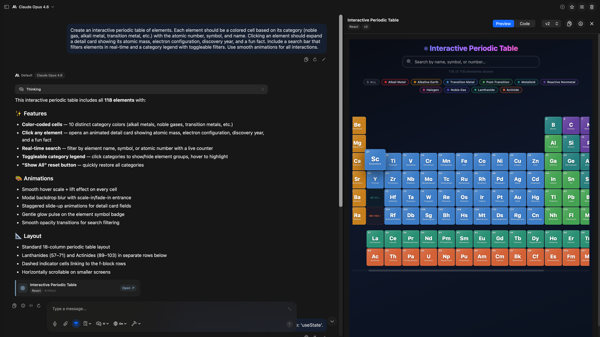

<p align="center">
  
</p>

# Jin

A native macOS app for working with multiple LLM providers from one conversation workspace.
Conversation-first, tool-aware, and built for macOS instead of Electron.


<p align="center">
  
</p>

## Why Jin

- **Conversation-first** — Built around chat flow and fast iteration, not workspace clutter
- **Provider-aware controls** — Exposes model-specific settings like reasoning, search, caching, PDF handling, service tier, code execution, and media options instead of hiding them behind generic presets
- **Native macOS workflow** — SwiftUI app with drag-and-drop, split views, custom keyboard shortcuts, recovery tools, and Sparkle updates
- **One app for chat + tools** — Chat, MCP, built-in search, artifacts, voice, coding workflows, and media generation live in the same workspace

## Features

- **Multi-provider chat** — Work across OpenAI, Anthropic, Gemini, Vertex AI, xAI, gateway providers, and more from one app
- **Parallel multi-model chat** — Add up to 3 models to one conversation, compare responses side-by-side, and keep per-model context independent
- **Multimodal threads** — Mix text, images, files, audio, PDFs, and generated media in one conversation
- **Markdown, code, and LaTeX rendering** — Syntax-highlighted code blocks, markdown rendering, inline/block math, and copy-friendly output
- **Reasoning and advanced model controls** — Per-chat controls for reasoning budget, web search, prompt caching, PDF mode, OpenAI service tier, and other provider-specific options
- **Search and grounding** — Provider-native web search plus built-in search plugins, source cards, citation timeline, and Google Maps grounding for Gemini / Vertex AI
- **MCP tool calling** — Connect external tools and data through MCP servers over stdio or HTTP, with persistent or ephemeral server lifecycles
- **Provider-native code execution** — Run supported model-side code execution flows with visible activity timeline, logs, generated images, and downloadable files
- **Artifacts workspace** — Inline HTML, React, and ECharts artifacts with split-pane preview, version history, source export, and reusable artifact IDs
- **Image and video generation** — Image generation/editing across OpenAI (GPT Image / DALL·E) and xAI; video generation across xAI, Google Veo (Gemini & Vertex), and OpenRouter SeedDance, including source-image and source-URL edit workflows where available
- **PDF and OCR handling** — Native PDF upload where supported, with Mistral OCR / MinerU / DeepSeek / OpenRouter / Firecrawl as cloud OCR fallbacks plus local macOS extraction
- **Voice workflows** — Speech-to-text and text-to-speech via cloud providers or on-device WhisperKit / TTSKit models, with a floating mini-player for chat playback
- **Assistants and defaults** — Named assistants with custom prompts, language preference, model defaults, temperature/output settings, and optional history truncation
- **Quoted reply blocks** — Pin a snippet from any message into the composer as a structured quote so the next turn keeps the reference highlighted in the thread
- **macOS polish** — Configurable shortcuts, drag-and-drop attachments, storage breakdown with chat diagnostics, recovery pack export/import, and in-app Sparkle update controls

## Screenshots

<p align="center">
  
</p>

<p align="center">
  
</p>

<p align="center">
  
</p>

<p align="center">
  
</p>

<p align="center">
  
</p>

<p align="center">
  
</p>

<p align="center">
  
</p>

<p align="center">
  
</p>

<p align="center">
  
</p>

## Supported Providers

Configure providers in **Settings > Providers**. Jin supports direct providers, gateways, and coding-focused runtimes:

OpenAI · OpenAI (WebSocket) · Anthropic · Claude Managed Agents · Gemini (AI Studio) · Vertex AI · xAI · Perplexity · Groq · Cohere · Mistral · DeepInfra · Together AI · Fireworks · SambaNova · Cerebras · DeepSeek · Zhipu Coding Plan · MiniMax · MiniMax Coding Plan · Xiaomi MiMo Token Plan · Zyphra · MorphLLM · OpenCode Go · GitHub Copilot · OpenRouter · OpenAI Compatible · Cloudflare AI Gateway · Vercel AI Gateway

- **Most providers** use an API key.
- **Vertex AI** uses a service account JSON.
- **Claude Managed Agents** uses an Anthropic API key and routes through Anthropic's managed-agent runtime (custom tools, persistent sessions, prompt caching).
- **Xiaomi MiMo Token Plan** ships in two flavors — Anthropic-compatible and OpenAI-compatible — so you can use whichever upstream API surface a given MiMo model expects.
- **Gateway providers** such as OpenRouter, Cloudflare AI Gateway, Vercel AI Gateway, and OpenAI Compatible can route upstream models while still benefiting from Jin's model metadata when the exact upstream model ID is known.

### Model Catalog

- Jin ships with curated seed models for major providers so you can start chatting immediately after adding credentials.
- Use **Fetch Models** to pull fresh provider model lists when the provider supports catalog fetching.
- You can also add model IDs manually, including gateway-prefixed IDs like `openai/...` and `anthropic/...`.
- Known models use exact-ID capability metadata for context window, reasoning behavior, vision, web search, PDF handling, code execution, image/video generation, and other features.
- Unknown model IDs still work, but Jin falls back to conservative defaults until metadata is available.

## Plugins

All plugins are optional and configured in **Settings > Plugins**.

| Plugin | Services |
|--------|----------|
| Web Search | Exa, Brave Search, Jina Search, Firecrawl, Tavily, Perplexity Search |
| Text-to-Speech | OpenAI, OpenRouter, Groq, ElevenLabs, Xiaomi MiMo, TTSKit (on-device) |
| Speech-to-Text | OpenAI, OpenRouter, Groq, Mistral, ElevenLabs, WhisperKit (on-device) |
| PDF OCR | Mistral OCR, MinerU, DeepSeek (via DeepInfra), OpenRouter OCR, Firecrawl OCR — used as fallback when the active model can't natively ingest PDFs |
| Chat Naming | Automatic conversation naming with a selected model |
| Cloudflare R2 Upload | Upload local videos to R2 and use public URLs in video workflows |

## MCP (Model Context Protocol)

Connect MCP servers under **Settings > MCP Servers**.

- Supports **persistent** and **ephemeral** server lifecycles
- Supports **stdio** and **HTTP** transports, including streaming HTTP setups
- Supports server presets plus `mcpServers` JSON import
- Keeps per-server tool enablement and per-chat MCP selection separate
- Supports HTTP authentication with bearer token or custom headers

## Installation

### Download

Download the latest release from the [Releases](../../releases) page.

- Release assets typically include `Jin.zip`, and release automation may also publish `Jin.dmg`
- Jin uses [Sparkle](https://github.com/sparkle-project/Sparkle) for in-app updates after installation
- Current packaged builds are **Apple Silicon-only**
- If your release is zipped, unzip it first

### If macOS blocks the app

If macOS shows a warning like "is damaged and can't be opened" or "Apple could not verify":

1. Move `Jin.app` to `/Applications`.
2. Right-click `Jin.app` and choose **Open** once.
3. If it is still blocked, open **System Settings > Privacy & Security**.
4. Click **Open Anyway** for Jin, then confirm **Open**.
5. If needed, clear quarantine and retry:

```bash
xattr -dr com.apple.quarantine /Applications/Jin.app
```

### Requirements

- Apple Silicon Mac for packaged release builds
- macOS 14 (Sonoma) or later

## Getting Started

1. Launch Jin.
2. Open **Settings > Providers** and add a provider credential. Most providers use API keys, while Vertex AI uses a service account JSON.
3. Start a new conversation and pick one model, or add up to 3 models to the same chat.
4. Optional: enable plugins in **Settings > Plugins** for search, OCR, voice, or cloud upload.
5. Optional: add MCP servers in **Settings > MCP Servers** for tool calling.
6. Optional: customize **General** settings for appearance, keyboard shortcuts, chat defaults, updates, and data / recovery tools.

## Build from Source

```bash
git clone https://github.com/hrayleung/Jin.git
cd Jin
swift build
swift test
swift run Jin                 # Run from the command line (Debug)
open Package.swift           # Open in Xcode
bash Packaging/package.sh    # Build arm64 .app bundle and create dist/Jin.zip
bash Packaging/package.sh dmg
```

Requires Swift 5.9+ / Xcode 15+.

## Updates & Release

Jin uses [Sparkle](https://github.com/sparkle-project/Sparkle) for in-app updates.

- **Settings > General > Updates** exposes automatic update checks and optional pre-release channel opt-in
- Update feed and signing key are configured in `Packaging/Info.plist` (`SUFeedURL`, `SUPublicEDKey`)
- The appcast lives at `docs/appcast.xml`
- CI packaging, signing, notarization, and release publishing live in `.github/workflows/ci-cd.yml`

## Contributing

Contributions are welcome. Unless explicitly stated otherwise, contributions are accepted under the same [Apache License 2.0](LICENSE).

## License

[Apache License 2.0](LICENSE) — permissive open-source licensing with an express patent grant. See the [full license text](https://www.apache.org/licenses/LICENSE-2.0) for details.

## Acknowledgments

- [MCP Swift SDK](https://github.com/modelcontextprotocol/swift-sdk) — Model Context Protocol client library
- [Sparkle](https://github.com/sparkle-project/Sparkle) — In-app update framework for macOS
- [Alamofire](https://github.com/Alamofire/Alamofire) — Networking primitives
- [WhisperKit](https://github.com/argmaxinc/WhisperKit) — On-device speech-to-text
- [Kingfisher](https://github.com/onevcat/Kingfisher) — Image loading and caching
- [swift-collections](https://github.com/apple/swift-collections) — Ordered/persistent collection types
- [Lobe Icons](https://github.com/lobehub/lobe-icons) — Provider icon assets
