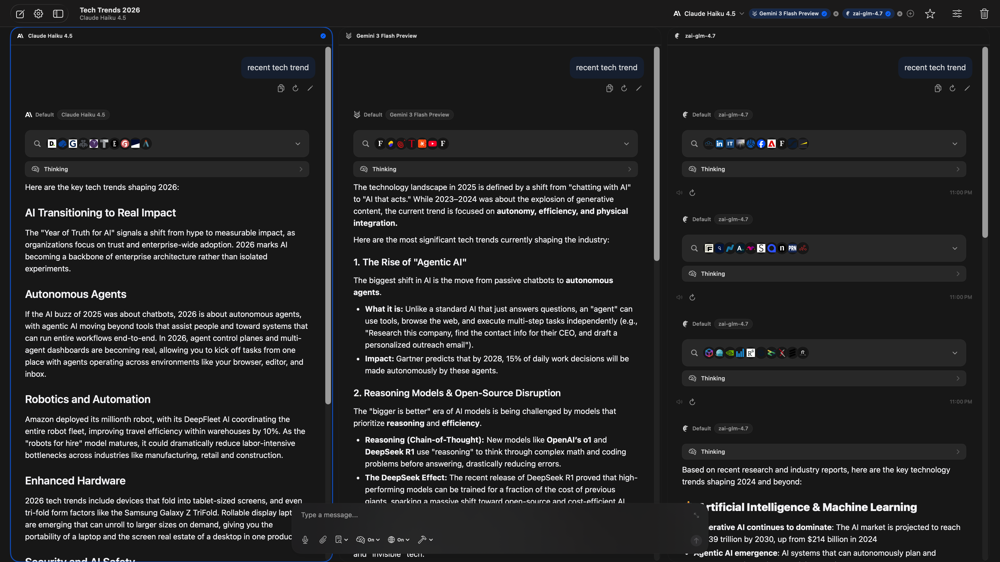
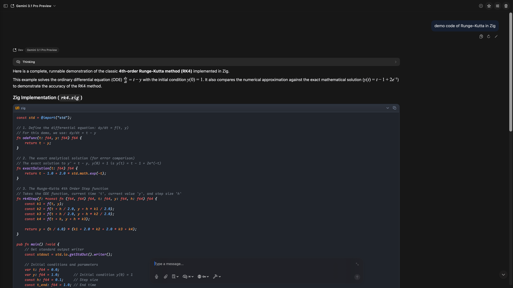
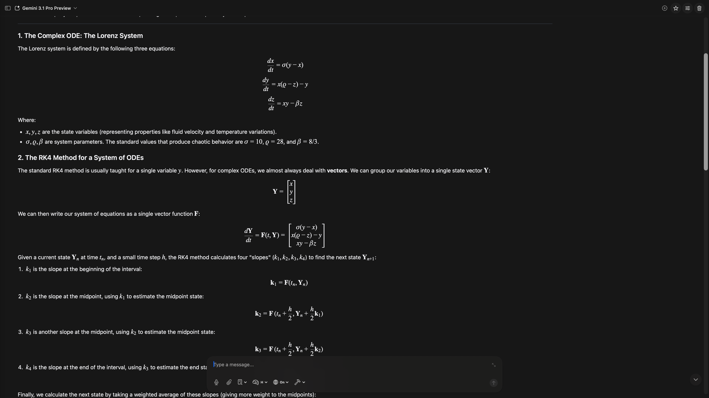
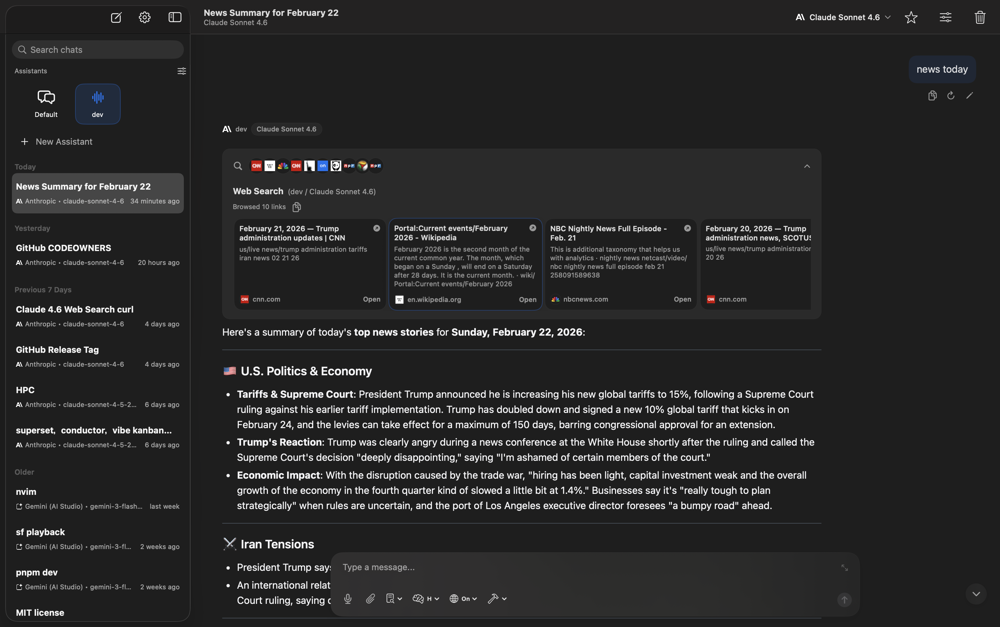
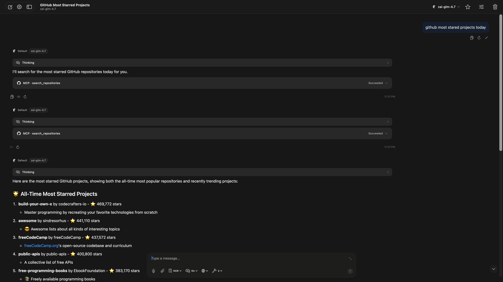
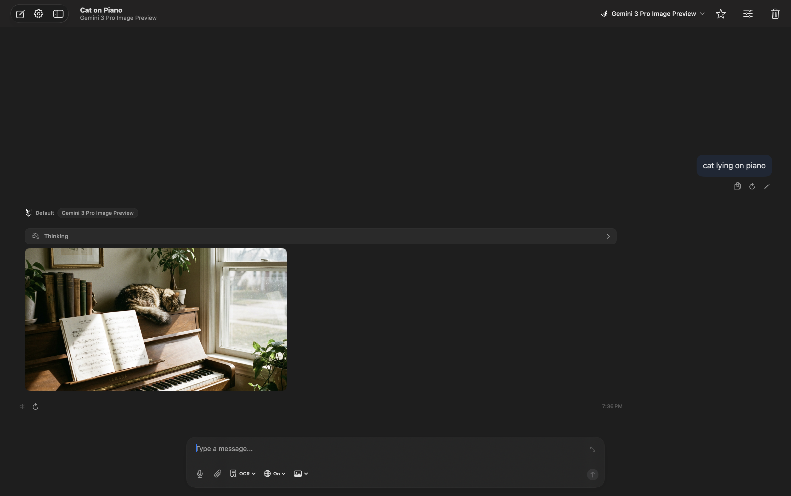
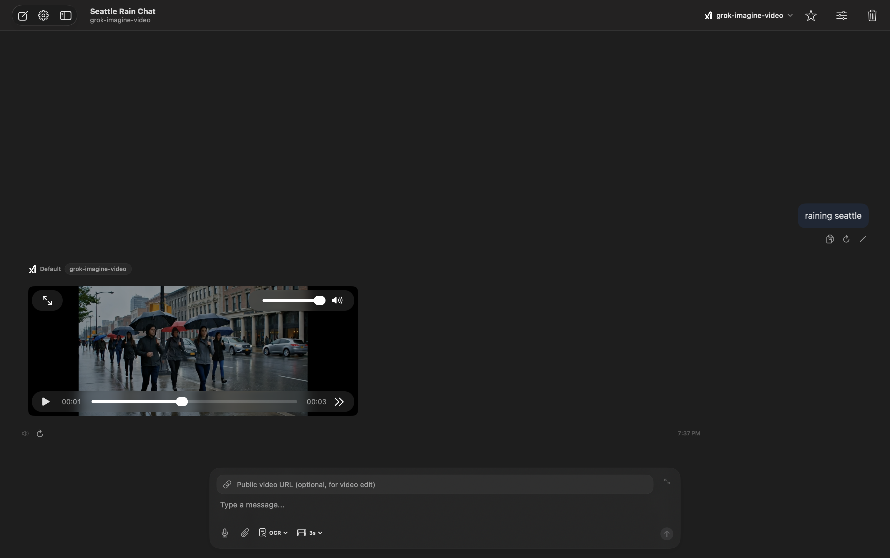
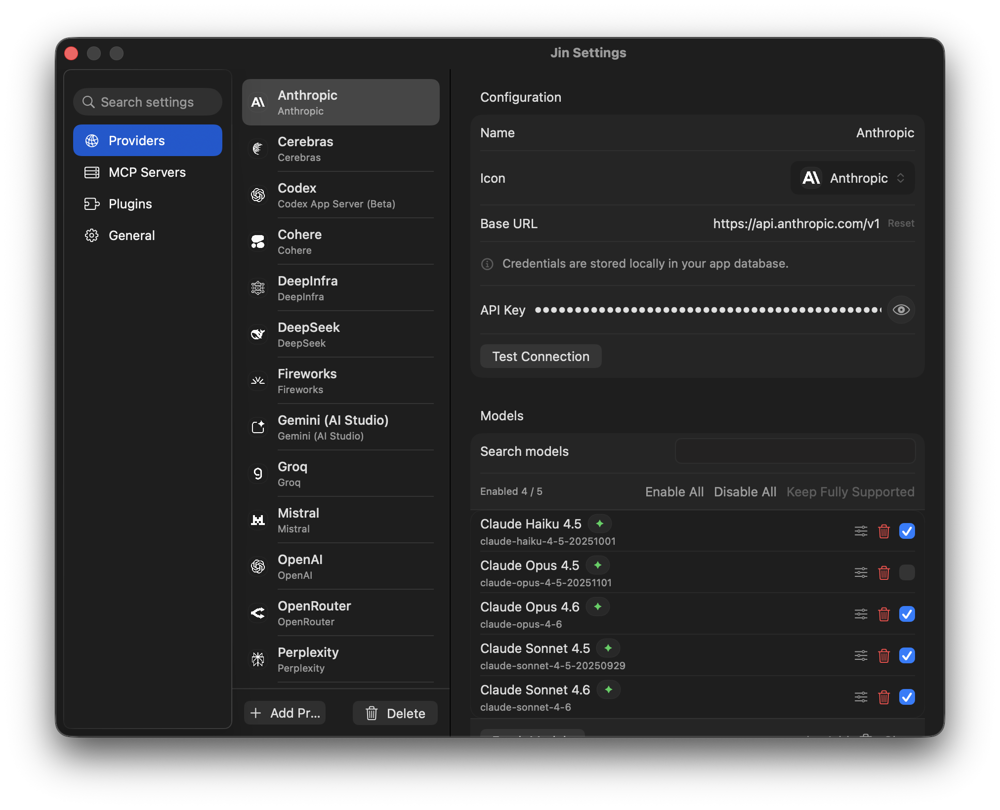

<p align="center">
  
</p>

# Jin

A native macOS app for chatting with multiple LLM providers from one workspace.
Conversation-first: fast, focused, and minimal.


## Why Jin

- **Conversation-first** — Built around high-quality chat flow, not workspace clutter
- **Focused controls** — Model, reasoning, tool, and media controls stay close to the conversation
- **Full API access** — Expose provider parameters as completely as practical instead of hiding them behind generic presets
- **Native macOS** — SwiftUI app with keyboard shortcuts, drag-and-drop, and proper windowing — no Electron

## Features

- **Multi-provider chat** — Switch between providers and models within the same workspace
- **Parallel multi-model chat** — Ask up to 3 models in one chat, with side-by-side responses and independent per-model context
- **Multimodal conversations** — Text, images, files, audio, and generated media in one thread
- **Markdown, code & LaTeX rendering** — Syntax-highlighted code blocks with copy support, full markdown rendering, and inline/block LaTeX math in responses
- **Reasoning models** — Collapsible thinking blocks for models that support extended reasoning, with per-model budget controls
- **Web search** — Provider-native search plus fallback through built-in search plugins (Exa, Brave, Jina, Firecrawl, Tavily), with in-chat search activity, citations, and source timeline
- **Context caching** — Model-aware caching controls (mode, TTL, strategy) across supported providers
- **Tool calling (MCP)** — Connect external tools and data via the Model Context Protocol using persistent or ephemeral servers
- **Image generation + edits** — OpenAI, Gemini, Vertex AI, and xAI image generation; OpenAI (gpt-image-1/1.5) and xAI support image edit flows by attaching a source image
- **Video generation + edits** — Gemini/Vertex Veo and xAI video flows, with optional public URL input for editable workflows
- **PDF processing** — Native PDF for supported models, or explicit Mistral/DeepSeek OCR modes and local macOS extraction fallback
- **Voice** — Speech-to-text (dictation or audio attachment when supported) and text-to-speech from assistant messages
- **Assistants** — Named assistants with custom prompts, model defaults, language preference, temperature/output limits, and optional history truncation
- **OpenAI service tier** — Choose between Default, Flex, Priority, and Scale processing tiers for OpenAI models

## Screenshots

<p align="center">
  
</p>

<p align="center">
  
</p>

<p align="center">
  
</p>

<p align="center">
  
</p>

<p align="center">
  
</p>

<p align="center">
  
</p>

<p align="center">
  
</p>

<p align="center">
  
</p>

## Supported Providers

Jin supports 23 provider types. Most require an API key. Configure providers in **Settings > Providers**. Use **Fetch Models** to pull the latest model list, or add models manually.

OpenAI · OpenAI (WebSocket) · Anthropic · Gemini (AI Studio) · Vertex AI · xAI · DeepSeek · Zhipu Coding Plan · Together AI · SambaNova · Mistral · Cohere · Groq · Perplexity · Fireworks · Cerebras · DeepInfra · OpenRouter · OpenAI Compatible · Cloudflare AI Gateway · Vercel AI Gateway · Codex App Server (Beta)

**Vertex AI** uses a service account JSON instead of an API key. **Codex App Server** supports API key, ChatGPT account, or Local Codex (`auth.json` from `$CODEX_HOME` or `~/.codex`) — run `codex app-server --listen ws://127.0.0.1:4500` or launch from provider settings. Recommended runtime: `codex` **0.107.0+**.

### Included Models

Each provider ships with a set of pre-loaded models that appear in the model picker on first launch. Additional models are catalog-recognized — they work with full capability metadata when added via **Fetch Models** or entered manually. Unlisted model IDs fall back to conservative defaults.

<details>
<summary><strong>OpenAI / OpenAI (WebSocket)</strong></summary>

Pre-loaded: `gpt-5.4`, `gpt-5.4-2026-03-05`, `gpt-5.4-pro`, `gpt-5.4-pro-2026-03-05`, `gpt-5.2`, `gpt-5.2-2025-12-11`, `gpt-5.3-codex`, `gpt-4o`, `gpt-image-1.5`, `gpt-image-1`

Also recognized: `gpt-5.3-chat-latest`, `gpt-5`, `o3`, `o4`, `gpt-image-1-mini`, `dall-e-3`, `dall-e-2`
</details>

<details>
<summary><strong>Anthropic</strong></summary>

Pre-loaded: `claude-opus-4-6`, `claude-sonnet-4-6`, `claude-opus-4-5-20251101`, `claude-sonnet-4-5-20250929`, `claude-haiku-4-5-20251001`

Also recognized: `claude-opus-4`, `claude-sonnet-4`, `claude-haiku-4`
</details>

<details>
<summary><strong>Gemini (AI Studio)</strong></summary>

Pre-loaded: `gemini-3-pro-preview`, `gemini-3.1-pro-preview`, `gemini-3-pro-image-preview`, `gemini-3.1-flash-image-preview`, `gemini-3-flash-preview`, `gemini-3.1-flash-lite-preview`, `gemini-2.5-flash-image`

Also recognized: `gemini-3`, `gemini-3-pro`, `veo-2`, `veo-3`
</details>

<details>
<summary><strong>Vertex AI</strong></summary>

Pre-loaded: `gemini-3-pro-preview`, `gemini-3.1-pro-preview`, `gemini-3-pro-image-preview`, `gemini-3.1-flash-image-preview`, `gemini-3-flash-preview`, `gemini-3.1-flash-lite-preview`, `gemini-2.5-pro`, `gemini-2.5-flash-image`

Also recognized: `gemini-3`, `gemini-3-pro`, `gemini-2.5`, `gemini-2.5-flash`, `gemini-2.5-flash-lite`, `veo-2`, `veo-3`
</details>

<details>
<summary><strong>xAI</strong></summary>

Pre-loaded: `grok-4-1-fast`, `grok-4-1`, `grok-imagine-image`, `grok-imagine-image-pro`, `grok-2-image-1212`, `grok-imagine-video`

Also recognized: `grok-4-1-fast-non-reasoning`, `grok-4-1-fast-reasoning`
</details>

<details>
<summary><strong>DeepSeek</strong></summary>

Pre-loaded: `deepseek-chat`, `deepseek-reasoner`, `deepseek-v3.2-exp`
</details>

<details>
<summary><strong>Perplexity</strong></summary>

Pre-loaded: `sonar`, `sonar-pro`, `sonar-reasoning-pro`, `sonar-deep-research`

Also recognized: `sonar-reasoning`
</details>

<details>
<summary><strong>Together AI</strong></summary>

Pre-loaded: `Qwen/Qwen3.5-397B-A17B`, `MiniMaxAI/MiniMax-M2.5`, `zai-org/GLM-5`, `Qwen/Qwen3-Coder-Next-FP8`, `moonshotai/Kimi-K2.5`
</details>

<details>
<summary><strong>SambaNova</strong></summary>

Pre-loaded: `MiniMax-M2.5`, `gpt-oss-120b`

Also recognized: `DeepSeek-V3.2`, `DeepSeek-R1-0528`, `DeepSeek-V3-0324`, `DeepSeek-V3.1`, and others
</details>

<details>
<summary><strong>Fireworks</strong></summary>

Pre-loaded: `fireworks/glm-5`, `fireworks/minimax-m2p5`, `fireworks/kimi-k2p5`, `fireworks/glm-4p7`

Alternate IDs also recognized: `accounts/fireworks/models/glm-5`, `accounts/fireworks/models/minimax-m2p5`, `accounts/fireworks/models/kimi-k2p5`, `accounts/fireworks/models/glm-4p7`
</details>

<details>
<summary><strong>Zhipu Coding Plan</strong></summary>

Pre-loaded: `glm-5`, `glm-4.7`
</details>

<details>
<summary><strong>Cerebras</strong></summary>

Recognized: `zai-glm-4.7`
</details>

<details>
<summary><strong>Codex App Server (Beta)</strong></summary>

Pre-loaded: `gpt-5.1-codex` (default seed), plus any models exposed by your server
</details>

<details>
<summary><strong>Gateway providers (Cloudflare, Vercel, OpenRouter)</strong></summary>

These providers route to upstream models. Jin includes catalog records for common upstream model IDs so capability metadata (context window, reasoning, vision, etc.) is applied automatically. See the model catalog in the app for the full list.
</details>

<details>
<summary><strong>Groq, Cohere, Mistral, DeepInfra, OpenAI Compatible</strong></summary>

Use **Fetch Models** to pull available models, or add model IDs manually.
</details>

## Plugins

All plugins are optional and configured in **Settings > Plugins**.

| Plugin | Services |
|--------|----------|
| Web Search | Exa, Brave Search, Jina Search, Firecrawl, Tavily |
| Text-to-Speech | ElevenLabs, OpenAI, Groq |
| Speech-to-Text | OpenAI, Groq, Mistral |
| Mistral OCR | Mistral OCR for PDF extraction |
| DeepSeek OCR | DeepSeek OCR (via DeepInfra) for PDF extraction |
| Chat Naming | Automatic conversation naming with a selected model |
| Cloudflare R2 Upload | Upload local videos to R2 and send public URLs |

## MCP (Model Context Protocol)

Connect MCP servers for tool calling under **Settings > MCP Servers**. Jin supports long-running (persistent) and short-lived (ephemeral) MCP servers over stdio or HTTP/SSE transports. Server presets and `mcpServers` JSON import are supported; each server keeps separate tool enablement, and MCP calls can be used with per-chat controls.

## Installation

### Download

Download the latest release from the [Releases](../../releases) page. Assets are typically `Jin.zip` (containing `Jin.app`) or `Jin.dmg`.
If your release is zipped, unzip it first.

### If macOS blocks the app

If macOS shows a warning like "is damaged and can't be opened" or "Apple could not verify":

1. Move `Jin.app` to `/Applications`.
2. Right-click `Jin.app` and choose **Open** once.
3. If it is still blocked, open **System Settings > Privacy & Security**.
4. Click **Open Anyway** for Jin, then confirm **Open**.
5. If needed, clear quarantine and retry:

```bash
xattr -dr com.apple.quarantine /Applications/Jin.app
```

### Requirements

- macOS 14 (Sonoma) or later

## Getting Started

1. Launch Jin.
2. Open **Settings** and add a provider (API key for most providers; service account JSON for Vertex AI; optional for Codex App Server).
3. Start a new conversation and pick a model.
4. Optional: configure MCP servers under **Settings > MCP Servers** for tool calling.

## Build from Source

```bash
git clone https://github.com/hrayleung/Jin.git
cd Jin
swift build
swift test
swift run Jin            # Run from the command line (Debug)
open Package.swift          # Open in Xcode
bash Packaging/package.sh   # Build universal release .app bundle and create dist/Jin.zip
bash Packaging/package.sh dmg  # Optional: also create a DMG
```

Requires Swift 5.9+ / Xcode 15+.

## Updates & Release

Jin uses [Sparkle](https://github.com/sparkle-project/Sparkle) for in-app updates.

- Update feed and signing key are configured in `Packaging/Info.plist` (`SUFeedURL`, `SUPublicEDKey`).
- The appcast lives at `docs/appcast.xml` (published via GitHub Pages for the upstream repo).
- CI packaging/signing is in `.github/workflows/ci-cd.yml` (Build + notarized DMG on `v*` tags).


## Contributing

Contributions are welcome. All contributions fall under the same [PolyForm Noncommercial License](LICENSE).

## License

[PolyForm Noncommercial License 1.0.0](LICENSE) — free to use, modify, and distribute for noncommercial purposes. See the [full license text](https://polyformproject.org/licenses/noncommercial/1.0.0/) for details.

## Acknowledgments

- [MCP Swift SDK](https://github.com/modelcontextprotocol/swift-sdk) — Model Context Protocol client library
- [Sparkle](https://github.com/sparkle-project/Sparkle) — In-app update framework for macOS
- [Lobe Icons](https://github.com/lobehub/lobe-icons) — Provider icon assets
