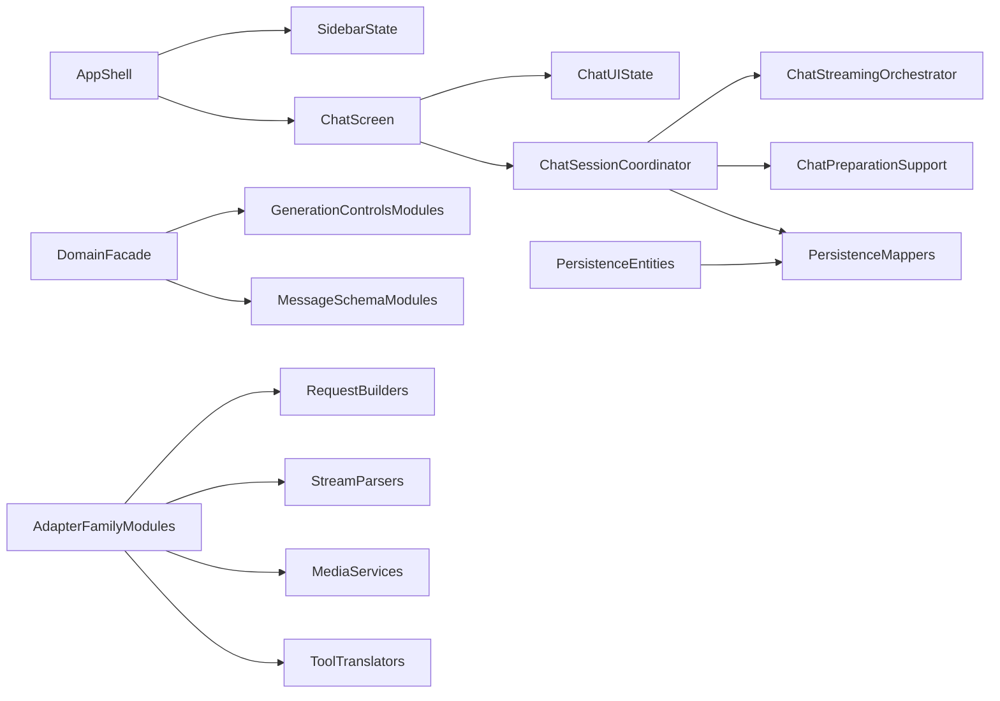

# 全仓可维护性重构蓝图

## 目标

- 把巨型 SwiftUI 页面拆成清晰的壳层、子视图、状态对象和协调器，优先处理 [Sources/UI/ChatView.swift](Sources/UI/ChatView.swift)、[Sources/UI/ProviderConfigFormView.swift](Sources/UI/ProviderConfigFormView.swift)、[Sources/UI/ContentView.swift](Sources/UI/ContentView.swift) 这类“视图 + 状态 + 副作用”混杂文件。
- 把核心 schema 从“持续堆字段的大文件”整理成 facade + typed submodules，重点清理 [Sources/Domain/GenerationControls.swift](Sources/Domain/GenerationControls.swift)、[Sources/Domain/Message.swift](Sources/Domain/Message.swift)、[Sources/Persistence/SwiftDataModels.swift](Sources/Persistence/SwiftDataModels.swift)。
- 把 provider 适配器从“大 actor / 大核心文件”继续沿现有切缝拆解，优先围绕 family 统一 `request builder`、`stream parser`、`content mapper`、`tool translator`、`media service`。
- 在整个过程中保持这些边界稳定：`LLMProviderAdapter` 契约、`StreamEvent` 语义顺序、`Message`/`ContentPart` Codable 形状、`GenerationControls` 对外语义、SwiftData 旧数据兼容行为。

## 当前热点

- UI 最大热点在 [Sources/UI/ChatView.swift](Sources/UI/ChatView.swift)。文件顶部直接持有 composer、附件、滚动、render cache、artifact pane、slash command、辅助控制面板、agent/codex、录音与多个 `Task`/sheet 状态，已经是典型单体屏幕。
- 全局壳层热点在 [Sources/UI/ContentView.swift](Sources/UI/ContentView.swift) 和 [Sources/UI/SettingsView.swift](Sources/UI/SettingsView.swift)。这两处同时负责导航选择、弹窗、CRUD、启动流程和局部业务协调。
- 表单热点在 [Sources/UI/ProviderConfigFormView.swift](Sources/UI/ProviderConfigFormView.swift)、[Sources/UI/TextToSpeechPluginSettingsView.swift](Sources/UI/TextToSpeechPluginSettingsView.swift)、[Sources/UI/SpeechToTextPluginSettingsView.swift](Sources/UI/SpeechToTextPluginSettingsView.swift)、[Sources/UI/AddProviderView.swift](Sources/UI/AddProviderView.swift)。它们把 draft、自动保存、网络校验、provider-specific 分支和 sheet 状态揉在一起。
- 领域与持久化热点在 [Sources/Domain/GenerationControls.swift](Sources/Domain/GenerationControls.swift)、[Sources/Domain/Message.swift](Sources/Domain/Message.swift)、[Sources/Domain/ModelCatalog.swift](Sources/Domain/ModelCatalog.swift)、[Sources/Domain/ModelCapabilityRegistry.swift](Sources/Domain/ModelCapabilityRegistry.swift)、[Sources/Persistence/SwiftDataModels.swift](Sources/Persistence/SwiftDataModels.swift)。
- 运行时热点在 [Sources/UI/ChatStreamingOrchestrator.swift](Sources/UI/ChatStreamingOrchestrator.swift)、[Sources/MCP/MCPClient.swift](Sources/MCP/MCPClient.swift)、[Sources/MCP/MCPHub.swift](Sources/MCP/MCPHub.swift)、[Sources/Networking/NetworkManager.swift](Sources/Networking/NetworkManager.swift)。

## 目标结构

## 执行顺序

### 1. 先补安全网，再动大结构

- 先为高风险、低覆盖区域补行为测试，优先是 [Sources/UI/ChatStreamingOrchestrator.swift](Sources/UI/ChatStreamingOrchestrator.swift)、[Sources/UI/ChatMessagePreparationSupport.swift](Sources/UI/ChatMessagePreparationSupport.swift)、[Sources/UI/ChatControlNormalizationSupport.swift](Sources/UI/ChatControlNormalizationSupport.swift)、[Sources/Adapters/ProviderHostedFileStore.swift](Sources/Adapters/ProviderHostedFileStore.swift)、[Sources/Adapters/ProviderManager.swift](Sources/Adapters/ProviderManager.swift)、[Sources/Persistence/SwiftDataModels.swift](Sources/Persistence/SwiftDataModels.swift)。
- 测试切题即可，不先追求“所有 UI 都有 UI tests”；重点锁住 streaming、message preparation、provider credentials dispatch、SwiftData round-trip、assistant settings persistence。

### 2. 先拆 UI 外壳，再拆聊天核心

- 把 [Sources/UI/ContentView.swift](Sources/UI/ContentView.swift) 先拆成 `AppShell`、`SidebarPane`、`ConversationSelectionCoordinator`、`AssistantSelectionCoordinator`、`GlobalModalState`，让导航/弹窗/启动流程不再缠在同一个 `body` 里。
- 把 [Sources/UI/AddProviderView.swift](Sources/UI/AddProviderView.swift)、[Sources/UI/AssistantInspectorView.swift](Sources/UI/AssistantInspectorView.swift)、[Sources/UI/SettingsView.swift](Sources/UI/SettingsView.swift) 作为第一批低风险文件级拆分，优先降低认知负担。
- 然后围绕 [Sources/UI/ChatView.swift](Sources/UI/ChatView.swift) 做二层重构：
  - `ChatScreen` 只保留布局与路由。
  - `ChatComposerState`、`ChatAuxiliaryControlsState`、`ChatRenderCacheState`、`ChatThreadSelectionState` 承担局部状态。
  - `ChatSessionCoordinator` 负责 send / cancel / persist / tool routing / streaming orchestration。
- 优先复用已有切缝和模式，例如 [Sources/UI/ChatView+ModelControls.swift](Sources/UI/ChatView+ModelControls.swift)、[Sources/UI/ChatMessageStageViews.swift](Sources/UI/ChatMessageStageViews.swift)、[Sources/UI/GoogleMapsSheetView.swift](Sources/UI/GoogleMapsSheetView.swift)，避免重新发明一套架构。

### 3. 统一大表单的状态模式

- 把 [Sources/UI/ProviderConfigFormView.swift](Sources/UI/ProviderConfigFormView.swift) 改造成 `provider-specific sections + draft state + side-effect store`，把凭证读写、连接测试、模型抓取、OpenRouter usage、Codex auth 从 `View` 中剥离。
- 把 [Sources/UI/TextToSpeechPluginSettingsView.swift](Sources/UI/TextToSpeechPluginSettingsView.swift) 和 [Sources/UI/SpeechToTextPluginSettingsView.swift](Sources/UI/SpeechToTextPluginSettingsView.swift) 统一成同一套模式：根视图只负责 section 排布，每个 provider 独立子视图，异步动作由 store 驱动。
- 所有 SwiftData 表单继续显式保存，保持当前持久化语义，不在这一阶段改变字段或保存时机。

### 4. 收拢领域模型与持久化映射

- 保留 [Sources/Domain/GenerationControls.swift](Sources/Domain/GenerationControls.swift) 作为稳定 facade，但把 provider 特例、媒体控制、web/tool/cache/code execution 拆回各自 typed modules，并逐步压缩 `providerSpecific` 的使用面。
- 把 [Sources/Domain/Message.swift](Sources/Domain/Message.swift) 按“消息核心 / 内容部件 / thinking / tool / activity / media asset”拆成多个文件，保持 Codable 形状不变。
- 把 [Sources/Persistence/SwiftDataModels.swift](Sources/Persistence/SwiftDataModels.swift) 拆成按实体分文件，并把 `toDomain` / `fromDomain` 和 legacy fallback 迁到 mapper/codec 层，避免实体定义同时承担 schema、编码和迁移兼容。
- 同步整理模型元数据簇：[Sources/Domain/ModelCatalog.swift](Sources/Domain/ModelCatalog.swift)、[Sources/Domain/ModelCatalogRecords.swift](Sources/Domain/ModelCatalogRecords.swift)、[Sources/Domain/ModelCapabilityRegistry.swift](Sources/Domain/ModelCapabilityRegistry.swift)、[Sources/Domain/ModelSettingsResolver.swift](Sources/Domain/ModelSettingsResolver.swift)、[Sources/Domain/DefaultProviderSeeds.swift](Sources/Domain/DefaultProviderSeeds.swift)，目标是统一成一个 `ModelMetadata` 子域并切断不必要的 UI 逆依赖。

### 5. 以 provider family 为单位做深拆

- OpenAI family 首先处理，因为 [Sources/Adapters/OpenAIChatCompletionsCore.swift](Sources/Adapters/OpenAIChatCompletionsCore.swift) 已经是很好的共享核心；下一步应继续拆出 `RequestBuilder`、`StreamDecoder`、`ReasoningExtractor`、`ToolCallAssembler`、`SourcesRenderer`。
- Google family 其次处理，围绕 [Sources/Adapters/GeminiAdapter.swift](Sources/Adapters/GeminiAdapter.swift)、[Sources/Adapters/VertexAIAdapter.swift](Sources/Adapters/VertexAIAdapter.swift)、[Sources/Adapters/GoogleVideoGenerationCore.swift](Sources/Adapters/GoogleVideoGenerationCore.swift) 提炼 `AuthStrategy`、`EndpointStrategy`、`ContentMapper`、`CachedContentService`、`VideoOperationPoller`。
- Anthropic、xAI、Codex 再按同一原则处理：保留 adapter 对外契约，把内部请求预处理、流解析、工具归一、媒体链路、状态轮询从主文件剥离。
- [Sources/Adapters/ProviderManager.swift](Sources/Adapters/ProviderManager.swift) 放在 family 重构之后整理成更清晰的 provider factory，而不是一开始就改注册入口。

### 6. 最后清理运行时基础设施

- 把 [Sources/MCP/MCPClient.swift](Sources/MCP/MCPClient.swift) 和 [Sources/MCP/MCPHub.swift](Sources/MCP/MCPHub.swift) 分成配置模型、启动器、transport client、diagnostics、tool router，不先改变对上层的 `toolDefinitions` / `executeTool` 行为。
- 把 [Sources/Networking/NetworkManager.swift](Sources/Networking/NetworkManager.swift) 继续纯化成执行边界，把错误映射、调试日志、request tracing 等细分出去。
- 把上传/下载/落盘链路中的 [Sources/Adapters/ProviderHostedFileStore.swift](Sources/Adapters/ProviderHostedFileStore.swift)、[Sources/Networking/CloudflareR2Uploader.swift](Sources/Networking/CloudflareR2Uploader.swift)、[Sources/Persistence/AttachmentStorageManager.swift](Sources/Persistence/AttachmentStorageManager.swift) 整理为更清楚的媒体服务层，但保持语义不变。

## 批次策略

- 虽然这是“全仓统一蓝图”，执行时仍应拆成可审阅批次，每批只跨一个主关注点：`UI shell`、`chat core`、`form state`、`domain schema`、`provider family`、`infra runtime`。
- 不要把 UI 协调层、SwiftData schema、MCP runtime、多个 provider family 混在同一个提交/PR 里。
- 第一批最值得先做的是：`ContentView / SettingsView / AddProviderView` 的拆壳 + `ChatStreamingOrchestrator` 行为测试补强。这样能先降低 UI 复杂度，同时不给核心数据模型引入太大回归风险。

## 验证与验收

- 每个批次先跑 `swift build`，再跑该批的 targeted tests，最后跑一次 `swift test`。
- 每个功能性批次结束后按仓库约定跑 `bash Packaging/package.sh`。
- UI/state 批次的人工 smoke checklist 至少覆盖：多 provider 发消息、线程切换、流式取消、附件/PDF、工具调用、设置页保存后重开校验。
- 整个重构期间默认不改公开行为、不改持久化字段形状、不改旧数据兼容策略；如果必须动这些边界，应作为单独批次显式处理。

